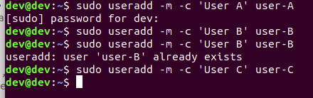
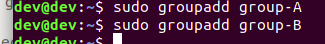
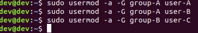
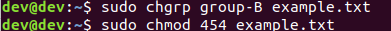
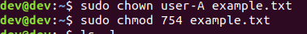
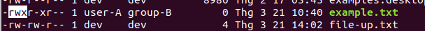
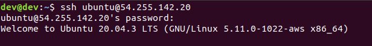
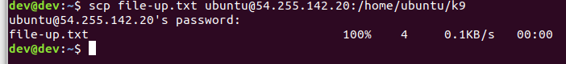
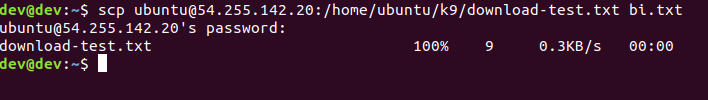

# Bài user, group,  file , ssh
1/ Tạo  3 user user-A, user-B, user-C và 2 group group-A, group-B

2/ Cho user-A, user-B vào group-1, user-C vào group-2

3/ Tạo 1 file example.txt với phân quyền user-A có  read write exec, group-2 chỉ có read và exec. Các user còn lại có thể read.  Thử login vào user-C và sửa đổi file example.txt điều gì sẽ xảy ra?

-----
Thông tin VPN
ip: 54.255.142.20
user: ubuntu
pass: 12312324hdev
------

4/ Upload 1 file đến VPN thông qua ssh để ở thư mục /home/ubuntu/k9

5/ Download 1 file từ máy VPN thông qua ssh để ở thư mục /home/ubuntu/k9/download-test.txt

6/ Config để 2 máy có thể ssh với nhau mà không cần đòi hỏi mật khẩu.

7/ Sử dụng public key và private key để bảo mật connect giữa 2 máy. Tham khảo Tạo SSH Key và xác thực kết nối SSH bằng Public/Private key
